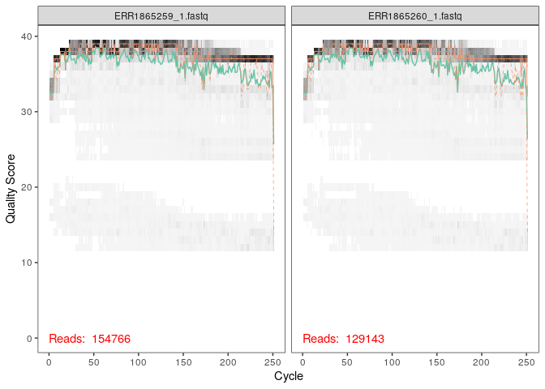
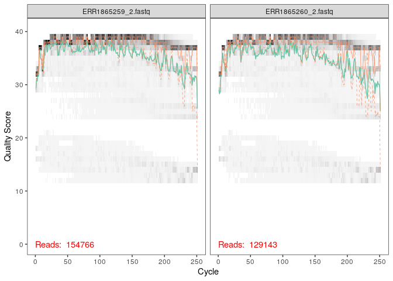
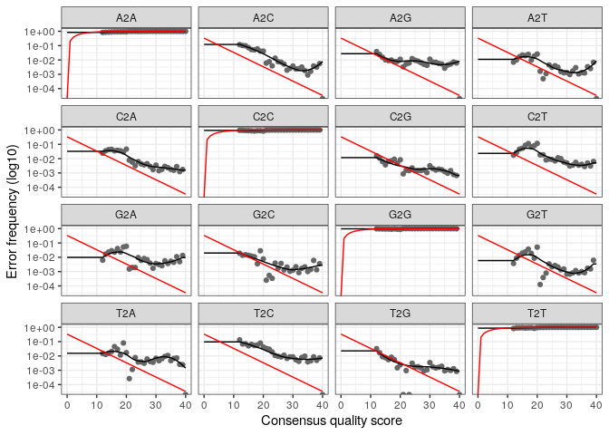
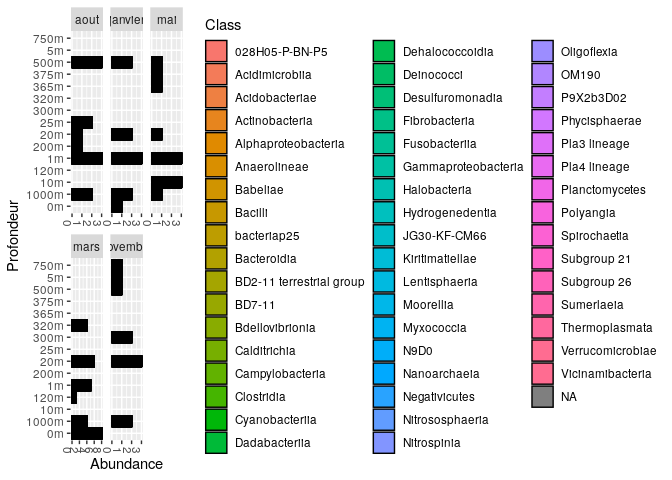
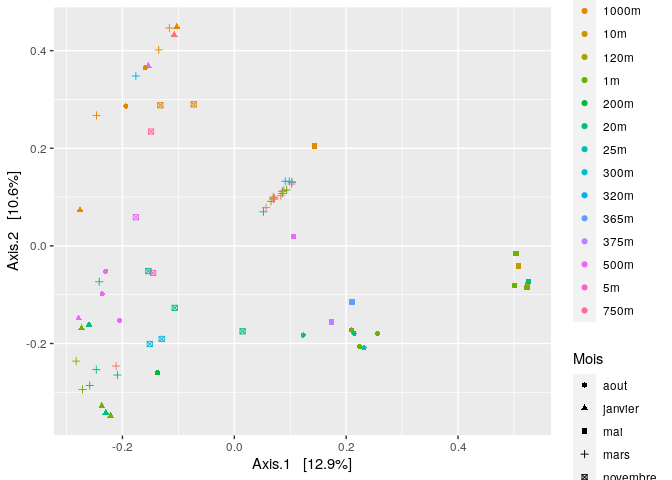

Analyse\_des\_données
================

  - [Méthodes](#méthodes)
      - [Des lectures aux tableaux](#des-lectures-aux-tableaux)
      - [Filtrer les données](#filtrer-les-données)
      - [Filtrez les lectures en amont et en
        aval](#filtrez-les-lectures-en-amont-et-en-aval)
  - [Connaitre les taux d’erreurs](#connaitre-les-taux-derreurs)
      - [Exemple d’inférence](#exemple-dinférence)
  - [Fusions des lectures et élimination des
    chimères](#fusions-des-lectures-et-élimination-des-chimères)
      - [Construire un tableau
        séquentiel](#construire-un-tableau-séquentiel)
      - [Supprimer les chimères](#supprimer-les-chimères)
  - [Attribuer une taxonomie](#attribuer-une-taxonomie)
  - [Regroupement des données de la diversité procaryotique en
    mois](#regroupement-des-données-de-la-diversité-procaryotique-en-mois)
      - [Combiner les données dans un objet
        phyloseq](#combiner-les-données-dans-un-objet-phyloseq)
  - [Diversité taxonomique et abondances
    relatives](#diversité-taxonomique-et-abondances-relatives)
  - [Analyse en Composantes Principales
    (PCoA)](#analyse-en-composantes-principales-pcoa)

Cette étude porte sur les données de l’article “Changements dans la
composition des procaryotes marins avec la saison et la profondeur au
cours d’une année polaire arctique” publié par Wilson et al en 2017.

# Méthodes

## Des lectures aux tableaux

Ce premier code permet d’importer les données de l’étude, à partir d’un
ensemble de fichiers fastq. Ici, on définit une variable chemin path,
afin de pouvoir accéder à ces données.

``` r
path <- "~/CC3EcoG2/donnees_CC3" # MODIFIER le répertoire contenant les fichiers fastq après la décompression
list.files(path)
```

## Filtrer les données

On filtre les séquences de faible qualité, puis on les enlève. On
demande ici d’afficher les “moins bons”.

``` r
# Le tri permet de s'assurer que les lectures en avant et en arrière sont dans le même ordre
fnFs <- sort(list.files(path, pattern="_1.fastq"))
fnRs <- sort(list.files(path, pattern="_2.fastq"))
# Extract sample names, assuming filenames have format: SAMPLENAME_XXX.fastq
sample.names <- sapply(strsplit(basename(fnFs), "_"), `[`, 1)
# Specify the full path to the fnFs and fnRs
fnFs <- file.path(path, fnFs)
fnRs <- file.path(path, fnRs)
```

On sait que plus on se rapproche de la fin des séquençages, moins bonne
sera leur qualité. En effet, on remarque que pour les lectures avant
(deux premiers graphes), le score de qualité moyen ne descend jamais en
dessous de 30. Au contraire, les graphes incarnant la fin des lectures
montrent un score de qualité plus bas (\~25). Ce type de chiffre
représente la probabilité que ce ne soit pas le bon nucléotide
d’appelé. De ce fait, avec un Q30 en début de séquences, il y a une
chance sur 1000 que ce soit le cas.

``` r
library(dada2)
```

    ## Loading required package: Rcpp

    ## Warning: multiple methods tables found for 'which'

``` r
plotQualityProfile(fnFs[1:2])
```

<!-- -->

``` r
plotQualityProfile(fnRs[1:2])
```

<!-- -->

On voit bien ici la moins bonne qualité des fins de séquences. En effet,
les scores de qualités baissent vers la position 220 pour les lectures
arrières, si on est extremement sélectifs. Néanmoins, de manière
générale, ces séquences sont de très bonne qualité. En prenant ces
informations en compte, on va pouvoir dans un premier temps créer des
variables pour les fichiers filtrés, puis appliquer la fonction
filterAndTrim.

``` r
filt_path <- file.path(path, "filtered") # Placez les fichiers filtrés dans le sous-répertoire "filtered"
if(!file_test("-d", filt_path)) dir.create(filt_path)
filtFs <- file.path(filt_path, paste0(sample.names, "_F_filt.fastq.gz"))
filtRs <- file.path(filt_path, paste0(sample.names, "_R_filt.fastq.gz"))
names(filtFs) <- sample.names
names(filtRs) <- sample.names
sample.names
```

    ##  [1] "ERR1865259" "ERR1865260" "ERR1865261" "ERR1865262" "ERR1865263"
    ##  [6] "ERR1865264" "ERR1865265" "ERR1865266" "ERR1865267" "ERR1865268"
    ## [11] "ERR1865269" "ERR1865270" "ERR1865271" "ERR1865272" "ERR1865273"
    ## [16] "ERR1865274" "ERR1865275" "ERR1865276" "ERR1865277" "ERR1865278"
    ## [21] "ERR1865279" "ERR1865280" "ERR1865281" "ERR1865282" "ERR1865283"
    ## [26] "ERR1865284" "ERR1865285" "ERR1865286" "ERR1865287" "ERR1865288"
    ## [31] "ERR1865289" "ERR1865290" "ERR1865291" "ERR1865292" "ERR1865293"
    ## [36] "ERR1865294" "ERR1865295" "ERR1865296" "ERR1865297" "ERR1865298"
    ## [41] "ERR1865299" "ERR1865300" "ERR1865301" "ERR1865302" "ERR1865303"
    ## [46] "ERR1865304" "ERR1865305" "ERR1865306" "ERR1865307" "ERR1865308"
    ## [51] "ERR1865309" "ERR1865310" "ERR1865311" "ERR1865312" "ERR1865313"
    ## [56] "ERR1865314" "ERR1865315" "ERR1865316" "ERR1865317" "ERR1865318"
    ## [61] "ERR1865319" "ERR1865320" "ERR1865321" "ERR1865322" "ERR1865323"
    ## [66] "ERR1865324" "ERR1865325" "ERR1865326" "ERR1865327" "ERR1865328"
    ## [71] "ERR1865329"

## Filtrez les lectures en amont et en aval

cf trimLeft=c(21,21) On pourrait aussi utiliser ce code pour retirer les
primers.

Cette fonction se base sur des fichiers contenant les lectures coupées
ayant passées les filtres. “TrimLeft” permet de retirer les primers afin
de ne pas les intégrer aux séquences étudiées. Le choix 240,240 pour
truncLen a été fait car nos données sont de manière générale de très
bonne qualité.

``` r
library(dada2)
out <- filterAndTrim(fnFs, filtFs, fnRs, filtRs, truncLen=c(240, 240),
              maxEE=c(2,2), rm.phix=TRUE,
              compress=TRUE, multithread=TRUE)
head(out)
```

    ##                    reads.in reads.out
    ## ERR1865259_1.fastq   154766    140600
    ## ERR1865260_1.fastq   129143    113314
    ## ERR1865261_1.fastq   138164    124364
    ## ERR1865262_1.fastq   148441    100950
    ## ERR1865263_1.fastq   175041    138447
    ## ERR1865264_1.fastq   129785    107663

# Connaitre les taux d’erreurs

Ci-dessous, la fonction learnErrors permet d’estimer les taux d’erreurs
à partir d’un grand ensemble de données. Ainsi, les résultats ci-après
expriment le nombre de bases qui sera finalement utilisé, par rapport au
premier ensemble.

``` r
errF <- learnErrors(filtFs, multithread=TRUE)
```

    ## 115014720 total bases in 479228 reads from 4 samples will be used for learning the error rates.

``` r
errR <- learnErrors(filtRs, multithread=TRUE)
```

    ## 115014720 total bases in 479228 reads from 4 samples will be used for learning the error rates.

``` r
plotErrors(errR, nominalQ=TRUE)
```

    ## Warning: Transformation introduced infinite values in continuous y-axis
    
    ## Warning: Transformation introduced infinite values in continuous y-axis

<!-- -->

``` r
library(ggplot2)
library(dada2)
plotErrors(errF, nominalQ=TRUE)
```

    ## Warning: Transformation introduced infinite values in continuous y-axis
    
    ## Warning: Transformation introduced infinite values in continuous y-axis

<!-- -->

Les figures ci-dessus représentent les estimations des taux d’erreurs en
fonction du score de qualité. La ligne rouge incarne la tendance
générale du graphique. Ensuite, les points noirs reflètent le taux
d’erreurs observées, et la ligne noire le taux d’erreurs ajustées. On
peut donc observer ci-dessus la fréquence du taux d’erreur en fonction
du score de qualité. Aucune différence significative ne peut être
relevée entre errR et errF. En effet, on observe la même tendance :
moins il y a d’erreurs, plus le score de qualité augmente, ce qui est en
accord avec les résultats attendus.

## Exemple d’inférence

La fonction dada retire les erreurs de séquençage et renvoie la
composition déduite des échantillons.

``` r
dadaFs <- dada(filtFs, err=errF, multithread=TRUE)
```

    ## Sample 1 - 140600 reads in 89550 unique sequences.
    ## Sample 2 - 113314 reads in 65256 unique sequences.
    ## Sample 3 - 124364 reads in 77897 unique sequences.
    ## Sample 4 - 100950 reads in 81381 unique sequences.
    ## Sample 5 - 138447 reads in 107845 unique sequences.
    ## Sample 6 - 107663 reads in 85638 unique sequences.
    ## Sample 7 - 126292 reads in 93234 unique sequences.
    ## Sample 8 - 122679 reads in 90786 unique sequences.
    ## Sample 9 - 145778 reads in 110245 unique sequences.
    ## Sample 10 - 153758 reads in 125667 unique sequences.
    ## Sample 11 - 110677 reads in 98866 unique sequences.
    ## Sample 12 - 112783 reads in 71414 unique sequences.
    ## Sample 13 - 101239 reads in 94510 unique sequences.
    ## Sample 14 - 124541 reads in 115005 unique sequences.
    ## Sample 15 - 135609 reads in 124509 unique sequences.
    ## Sample 16 - 148849 reads in 138326 unique sequences.
    ## Sample 17 - 87562 reads in 62953 unique sequences.
    ## Sample 18 - 91639 reads in 65286 unique sequences.
    ## Sample 19 - 74265 reads in 54281 unique sequences.
    ## Sample 20 - 145886 reads in 86507 unique sequences.
    ## Sample 21 - 188392 reads in 122868 unique sequences.
    ## Sample 22 - 135294 reads in 97205 unique sequences.
    ## Sample 23 - 122789 reads in 70690 unique sequences.
    ## Sample 24 - 74040 reads in 45002 unique sequences.
    ## Sample 25 - 103922 reads in 60940 unique sequences.
    ## Sample 26 - 176448 reads in 112581 unique sequences.
    ## Sample 27 - 169733 reads in 87771 unique sequences.
    ## Sample 28 - 112146 reads in 68464 unique sequences.
    ## Sample 29 - 131280 reads in 69898 unique sequences.
    ## Sample 30 - 121927 reads in 71361 unique sequences.
    ## Sample 31 - 191137 reads in 117821 unique sequences.
    ## Sample 32 - 152868 reads in 87848 unique sequences.
    ## Sample 33 - 140134 reads in 93108 unique sequences.
    ## Sample 34 - 118543 reads in 93859 unique sequences.
    ## Sample 35 - 159928 reads in 126917 unique sequences.
    ## Sample 36 - 146926 reads in 115235 unique sequences.
    ## Sample 37 - 136080 reads in 107016 unique sequences.
    ## Sample 38 - 160157 reads in 123182 unique sequences.
    ## Sample 39 - 158640 reads in 78226 unique sequences.
    ## Sample 40 - 209188 reads in 108766 unique sequences.
    ## Sample 41 - 135279 reads in 68651 unique sequences.
    ## Sample 42 - 120321 reads in 89172 unique sequences.
    ## Sample 43 - 127696 reads in 79249 unique sequences.
    ## Sample 44 - 101733 reads in 59123 unique sequences.
    ## Sample 45 - 172167 reads in 122518 unique sequences.
    ## Sample 46 - 106085 reads in 61790 unique sequences.
    ## Sample 47 - 169175 reads in 94870 unique sequences.
    ## Sample 48 - 100594 reads in 77606 unique sequences.
    ## Sample 49 - 223038 reads in 165141 unique sequences.
    ## Sample 50 - 79033 reads in 57774 unique sequences.
    ## Sample 51 - 72092 reads in 52211 unique sequences.
    ## Sample 52 - 64557 reads in 47043 unique sequences.
    ## Sample 53 - 75376 reads in 50257 unique sequences.
    ## Sample 54 - 84972 reads in 58763 unique sequences.
    ## Sample 55 - 72460 reads in 58798 unique sequences.
    ## Sample 56 - 77429 reads in 61182 unique sequences.
    ## Sample 57 - 105159 reads in 85126 unique sequences.
    ## Sample 58 - 61823 reads in 43035 unique sequences.
    ## Sample 59 - 70821 reads in 51927 unique sequences.
    ## Sample 60 - 71320 reads in 55296 unique sequences.
    ## Sample 61 - 91306 reads in 74353 unique sequences.
    ## Sample 62 - 84071 reads in 72149 unique sequences.
    ## Sample 63 - 84132 reads in 78319 unique sequences.
    ## Sample 64 - 81668 reads in 67467 unique sequences.
    ## Sample 65 - 79041 reads in 64151 unique sequences.
    ## Sample 66 - 100565 reads in 79893 unique sequences.
    ## Sample 67 - 95005 reads in 81198 unique sequences.
    ## Sample 68 - 98114 reads in 84194 unique sequences.
    ## Sample 69 - 86543 reads in 78915 unique sequences.
    ## Sample 70 - 98924 reads in 89148 unique sequences.
    ## Sample 71 - 82625 reads in 76096 unique sequences.

``` r
dadaRs <- dada(filtRs, err=errR, multithread=TRUE)
```

    ## Sample 1 - 140600 reads in 65808 unique sequences.
    ## Sample 2 - 113314 reads in 51707 unique sequences.
    ## Sample 3 - 124364 reads in 57342 unique sequences.
    ## Sample 4 - 100950 reads in 75849 unique sequences.
    ## Sample 5 - 138447 reads in 89156 unique sequences.
    ## Sample 6 - 107663 reads in 67791 unique sequences.
    ## Sample 7 - 126292 reads in 71008 unique sequences.
    ## Sample 8 - 122679 reads in 67136 unique sequences.
    ## Sample 9 - 145778 reads in 85984 unique sequences.
    ## Sample 10 - 153758 reads in 95843 unique sequences.
    ## Sample 11 - 110677 reads in 60397 unique sequences.
    ## Sample 12 - 112783 reads in 44134 unique sequences.
    ## Sample 13 - 101239 reads in 51660 unique sequences.
    ## Sample 14 - 124541 reads in 61222 unique sequences.
    ## Sample 15 - 135609 reads in 66953 unique sequences.
    ## Sample 16 - 148849 reads in 81075 unique sequences.
    ## Sample 17 - 87562 reads in 33527 unique sequences.
    ## Sample 18 - 91639 reads in 34483 unique sequences.
    ## Sample 19 - 74265 reads in 29451 unique sequences.
    ## Sample 20 - 145886 reads in 60480 unique sequences.
    ## Sample 21 - 188392 reads in 69717 unique sequences.
    ## Sample 22 - 135294 reads in 54843 unique sequences.
    ## Sample 23 - 122789 reads in 38700 unique sequences.
    ## Sample 24 - 74040 reads in 25170 unique sequences.
    ## Sample 25 - 103922 reads in 35610 unique sequences.
    ## Sample 26 - 176448 reads in 63555 unique sequences.
    ## Sample 27 - 169733 reads in 65923 unique sequences.
    ## Sample 28 - 112146 reads in 44268 unique sequences.
    ## Sample 29 - 131280 reads in 54882 unique sequences.
    ## Sample 30 - 121927 reads in 40854 unique sequences.
    ## Sample 31 - 191137 reads in 66724 unique sequences.
    ## Sample 32 - 152868 reads in 58383 unique sequences.
    ## Sample 33 - 140134 reads in 61672 unique sequences.
    ## Sample 34 - 118543 reads in 67733 unique sequences.
    ## Sample 35 - 159928 reads in 91514 unique sequences.
    ## Sample 36 - 146926 reads in 80370 unique sequences.
    ## Sample 37 - 136080 reads in 73966 unique sequences.
    ## Sample 38 - 160157 reads in 87204 unique sequences.
    ## Sample 39 - 158640 reads in 78009 unique sequences.
    ## Sample 40 - 209188 reads in 85968 unique sequences.
    ## Sample 41 - 135279 reads in 50159 unique sequences.
    ## Sample 42 - 120321 reads in 60615 unique sequences.
    ## Sample 43 - 127696 reads in 57060 unique sequences.
    ## Sample 44 - 101733 reads in 36667 unique sequences.
    ## Sample 45 - 172167 reads in 81199 unique sequences.
    ## Sample 46 - 106085 reads in 38885 unique sequences.
    ## Sample 47 - 169175 reads in 67543 unique sequences.
    ## Sample 48 - 100594 reads in 54854 unique sequences.
    ## Sample 49 - 223038 reads in 116938 unique sequences.
    ## Sample 50 - 79033 reads in 39581 unique sequences.
    ## Sample 51 - 72092 reads in 36692 unique sequences.
    ## Sample 52 - 64557 reads in 35178 unique sequences.
    ## Sample 53 - 75376 reads in 35190 unique sequences.
    ## Sample 54 - 84972 reads in 40728 unique sequences.
    ## Sample 55 - 72460 reads in 42952 unique sequences.
    ## Sample 56 - 77429 reads in 43735 unique sequences.
    ## Sample 57 - 105159 reads in 67399 unique sequences.
    ## Sample 58 - 61823 reads in 28159 unique sequences.
    ## Sample 59 - 70821 reads in 34129 unique sequences.
    ## Sample 60 - 71320 reads in 38680 unique sequences.
    ## Sample 61 - 91306 reads in 55015 unique sequences.
    ## Sample 62 - 84071 reads in 45838 unique sequences.
    ## Sample 63 - 84132 reads in 53076 unique sequences.
    ## Sample 64 - 81668 reads in 41889 unique sequences.
    ## Sample 65 - 79041 reads in 41105 unique sequences.
    ## Sample 66 - 100565 reads in 50332 unique sequences.
    ## Sample 67 - 95005 reads in 50706 unique sequences.
    ## Sample 68 - 98114 reads in 52599 unique sequences.
    ## Sample 69 - 86543 reads in 53171 unique sequences.
    ## Sample 70 - 98924 reads in 59477 unique sequences.
    ## Sample 71 - 82625 reads in 50626 unique sequences.

# Fusions des lectures et élimination des chimères

``` r
mergers <- mergePairs(dadaFs, filtFs, dadaRs, filtRs, verbose=TRUE)
```

    ## 119990 paired-reads (in 5210 unique pairings) successfully merged out of 132849 (in 7232 pairings) input.

    ## 98915 paired-reads (in 4427 unique pairings) successfully merged out of 107449 (in 5841 pairings) input.

    ## 107345 paired-reads (in 4655 unique pairings) successfully merged out of 117229 (in 6427 pairings) input.

    ## 78953 paired-reads (in 1218 unique pairings) successfully merged out of 90223 (in 2363 pairings) input.

    ## 109693 paired-reads (in 2478 unique pairings) successfully merged out of 127819 (in 4544 pairings) input.

    ## 83336 paired-reads (in 1776 unique pairings) successfully merged out of 98220 (in 3175 pairings) input.

    ## 100791 paired-reads (in 2994 unique pairings) successfully merged out of 116314 (in 5027 pairings) input.

    ## 98531 paired-reads (in 3129 unique pairings) successfully merged out of 113875 (in 4721 pairings) input.

    ## 110384 paired-reads (in 3090 unique pairings) successfully merged out of 132693 (in 5849 pairings) input.

    ## 106340 paired-reads (in 2325 unique pairings) successfully merged out of 135268 (in 5067 pairings) input.

    ## 56780 paired-reads (in 394 unique pairings) successfully merged out of 91799 (in 1510 pairings) input.

    ## 88736 paired-reads (in 2956 unique pairings) successfully merged out of 102492 (in 5009 pairings) input.

    ## 55548 paired-reads (in 592 unique pairings) successfully merged out of 81114 (in 1258 pairings) input.

    ## 70077 paired-reads (in 733 unique pairings) successfully merged out of 104911 (in 1653 pairings) input.

    ## 76557 paired-reads (in 756 unique pairings) successfully merged out of 114024 (in 1647 pairings) input.

    ## 88154 paired-reads (in 700 unique pairings) successfully merged out of 126442 (in 2116 pairings) input.

    ## 65021 paired-reads (in 1020 unique pairings) successfully merged out of 77798 (in 2099 pairings) input.

    ## 66782 paired-reads (in 915 unique pairings) successfully merged out of 83025 (in 2108 pairings) input.

    ## 55144 paired-reads (in 762 unique pairings) successfully merged out of 66461 (in 1678 pairings) input.

    ## 129088 paired-reads (in 6566 unique pairings) successfully merged out of 139080 (in 8386 pairings) input.

    ## 152949 paired-reads (in 4812 unique pairings) successfully merged out of 176141 (in 8714 pairings) input.

    ## 107746 paired-reads (in 1657 unique pairings) successfully merged out of 126262 (in 3203 pairings) input.

    ## 99540 paired-reads (in 3638 unique pairings) successfully merged out of 112868 (in 6199 pairings) input.

    ## 59003 paired-reads (in 1202 unique pairings) successfully merged out of 66848 (in 2562 pairings) input.

    ## 81658 paired-reads (in 2491 unique pairings) successfully merged out of 95000 (in 4552 pairings) input.

    ## 141741 paired-reads (in 6238 unique pairings) successfully merged out of 163050 (in 9855 pairings) input.

    ## 152739 paired-reads (in 7628 unique pairings) successfully merged out of 162245 (in 9394 pairings) input.

    ## 95881 paired-reads (in 3410 unique pairings) successfully merged out of 105912 (in 4632 pairings) input.

    ## 114651 paired-reads (in 5369 unique pairings) successfully merged out of 124583 (in 6883 pairings) input.

    ## 100402 paired-reads (in 2589 unique pairings) successfully merged out of 113984 (in 4178 pairings) input.

    ## 145640 paired-reads (in 8548 unique pairings) successfully merged out of 180700 (in 11320 pairings) input.

    ## 137236 paired-reads (in 6605 unique pairings) successfully merged out of 145581 (in 8009 pairings) input.

    ## 117928 paired-reads (in 4897 unique pairings) successfully merged out of 131494 (in 6252 pairings) input.

    ## 89972 paired-reads (in 2343 unique pairings) successfully merged out of 107758 (in 3898 pairings) input.

    ## 122141 paired-reads (in 2917 unique pairings) successfully merged out of 147430 (in 6112 pairings) input.

    ## 116951 paired-reads (in 3022 unique pairings) successfully merged out of 135831 (in 5265 pairings) input.

    ## 108147 paired-reads (in 2837 unique pairings) successfully merged out of 125527 (in 4378 pairings) input.

    ## 122018 paired-reads (in 3220 unique pairings) successfully merged out of 147194 (in 5843 pairings) input.

    ## 145764 paired-reads (in 7231 unique pairings) successfully merged out of 154702 (in 10434 pairings) input.

    ## 188743 paired-reads (in 9794 unique pairings) successfully merged out of 202668 (in 14070 pairings) input.

    ## 121013 paired-reads (in 6703 unique pairings) successfully merged out of 131129 (in 10145 pairings) input.

    ## 95268 paired-reads (in 3126 unique pairings) successfully merged out of 111247 (in 5792 pairings) input.

    ## 116222 paired-reads (in 4877 unique pairings) successfully merged out of 124056 (in 6867 pairings) input.

    ## 92497 paired-reads (in 4464 unique pairings) successfully merged out of 98649 (in 6114 pairings) input.

    ## 141753 paired-reads (in 5008 unique pairings) successfully merged out of 162969 (in 8309 pairings) input.

    ## 95903 paired-reads (in 4701 unique pairings) successfully merged out of 102679 (in 6480 pairings) input.

    ## 152457 paired-reads (in 7556 unique pairings) successfully merged out of 164408 (in 11198 pairings) input.

    ## 79537 paired-reads (in 2289 unique pairings) successfully merged out of 92492 (in 3464 pairings) input.

    ## 181319 paired-reads (in 5776 unique pairings) successfully merged out of 207600 (in 8972 pairings) input.

    ## 69017 paired-reads (in 2131 unique pairings) successfully merged out of 75426 (in 3133 pairings) input.

    ## 61534 paired-reads (in 1768 unique pairings) successfully merged out of 68865 (in 2822 pairings) input.

    ## 51261 paired-reads (in 1680 unique pairings) successfully merged out of 58895 (in 2626 pairings) input.

    ## 66781 paired-reads (in 2449 unique pairings) successfully merged out of 71753 (in 3257 pairings) input.

    ## 73633 paired-reads (in 2374 unique pairings) successfully merged out of 81297 (in 3490 pairings) input.

    ## 52748 paired-reads (in 1284 unique pairings) successfully merged out of 63653 (in 2263 pairings) input.

    ## 56400 paired-reads (in 1690 unique pairings) successfully merged out of 68572 (in 2827 pairings) input.

    ## 76694 paired-reads (in 1596 unique pairings) successfully merged out of 93710 (in 3090 pairings) input.

    ## 53488 paired-reads (in 1970 unique pairings) successfully merged out of 58732 (in 2601 pairings) input.

    ## 60059 paired-reads (in 1697 unique pairings) successfully merged out of 66574 (in 2521 pairings) input.

    ## 54970 paired-reads (in 1935 unique pairings) successfully merged out of 64322 (in 2864 pairings) input.

    ## 66049 paired-reads (in 1556 unique pairings) successfully merged out of 81165 (in 2733 pairings) input.

    ## 56155 paired-reads (in 726 unique pairings) successfully merged out of 73811 (in 1731 pairings) input.

    ## 51231 paired-reads (in 741 unique pairings) successfully merged out of 69262 (in 1525 pairings) input.

    ## 60988 paired-reads (in 1008 unique pairings) successfully merged out of 72895 (in 1678 pairings) input.

    ## 55810 paired-reads (in 960 unique pairings) successfully merged out of 68910 (in 2156 pairings) input.

    ## 71256 paired-reads (in 1438 unique pairings) successfully merged out of 89988 (in 3209 pairings) input.

    ## 61190 paired-reads (in 910 unique pairings) successfully merged out of 83629 (in 2361 pairings) input.

    ## 65326 paired-reads (in 905 unique pairings) successfully merged out of 86998 (in 2397 pairings) input.

    ## 51802 paired-reads (in 683 unique pairings) successfully merged out of 71233 (in 1494 pairings) input.

    ## 65914 paired-reads (in 894 unique pairings) successfully merged out of 83937 (in 1744 pairings) input.

    ## 49427 paired-reads (in 601 unique pairings) successfully merged out of 68229 (in 1246 pairings) input.

``` r
# Inspecter le fichier "merger data.frame" du premier échantillon
head(mergers[[1]])
```

    ##                                                                                                                                                                                                                                                                                                sequence
    ## 1 GGTGGCAGCAGCCGCGGTAATACGGAGGGGGCTAGCGTTGTTCGGAATTACTGGGCGTAAAGCGCGCGTAGGCGGCTAAGCAAGTTAGAGGTGAAAGCCCCGGGCTCAACCTGGGAATTGCCTTTAATACTGTTTAGCTTGAGTTCGGAAGAGGGAAGTGGAATTTCCAGTGTAGAGGTGAAATTCGTAGATATTGGAAAGAACACCAGTGGCGAAGGCGGCTTCCTGGTCCGATACTGACGCTGAGGTGCGAAAGCGTGGGGAGCAAACAGGATTAGAAACCCCAGTAGTCC
    ## 2 TTTTTCAGCAGCCGCGGTAATACGGAGGGGGCAAGCGTTGTTCGGAATTATTGGGCGTAAAGCGTATGTAGGCGGCTAAGCAAGTCAGGCGTGCAAGCCCGTGGCTCAACCACGGAATTGCGTTTGAAACTGCTTAGCTTGAGTACAGGAGAGGAAAGCGGAATTCCCAGTGTAGCGGTGAAATGCATTGATATTGGGAAGAACATCTGTGGCGAAGGCGGCTTTCTGGTCTGTTACTGACGCTGAGATACGAAAGCCAGGGGAGCGAACGGGATTAGAAACCCCAGTAGTCC
    ## 4 GGTGGCAGCAGCCGCGGTAATACGGAGGGTCCAAGCGTTAATCGGAATTACTGGGCGTAAAGCGCGCGTAGGCGGTTTAATAAGTTGTATGTGAAAGCCCTGGGCTCAACCTAGGAACTGCATACAAAACTATTAAGCTTGAGGACGAGAGAGGAGAGTAGAATTTCAGGTGTAGCGGTGAAATGCGTAGATATCTGAAGGAATACCAATGGCGAAGGCAGCTCTCTGGCTCGTTTCTGACGCTAAGGTGCGAAAGCGTGGGTAGCAAACAGGATTAGAAACCCCAGTAGTCC
    ## 5 GGTGGCAGCAGCCGCGGTAATACGGAGGGGGCTAGCGTTGTTCGGAATCACTGGGCGTAAAGCGTATGTAGGCGGATCAAAAAGTTAGATGTGAAATCCCTGGGCTTAACCTAGGAACTGCATTTAAAACTAGTGATCTAGAATTTGGTAGAGGTTAGTAGAATTTCCAGTGTAGAGGTGAAATTCGTAGATATTGGAAAGAATACCAGTGGCGAAGGCGACTAACTGGGCCATTTTTGACGCTGAGATACGAAAGCGTGGGTAGCAAACAGGATTAGAAACCCCAGTAGTCC
    ## 6 TTTTGCAGCAGCCGCGGTAATACGTAGGGGGCAAGCGTTGTCCGGAATTACTGGGCGTAAAGGGCCTGTAGGCGGCATGGTAAGTCCGTAGTGAAATCTCCCGGCTTAACTGGGAGCGGTCTATGGATACTGCCAAGCTAGAGATCATCAGAGGAGAGCGGAATTCCCGGTGTAGTGGTGAAATGCGTAGATATCGGGAGGAACACCAGTGGCGAAAGCGGCTCTCTGGGGTGGTTCTGACGCTGAGGGGCGAAAGCGTGGGGAGCAAACCGGATTAGAAACCCCAGTAGTCC
    ## 7 TTTTTCAGCAGCCGCGGTAAAACCAGCACCTCAAGTGGTCAGGATGATTATTGGGCCTAAAGCATCCGTAGCCGGCTCTGTAAGTTTTCGGTTAAATCTGTACGCTTAACGTACAGGCTGCCGGGAATACTGCAGAGCTAGGGAGTGGGAGAGGTAGACGGTACTCGGTAGGAAGTGGTAAAATGCTTTGATCTATCGATGACCACCTGTGGCGAAGGCGGTCTACCAGAACACGTCCGACGGTGAGGGATGAAAGCTGGGGGAGCAAACCGGATTAGAAACCCCAGTAGTCC
    ##   abundance forward reverse nmatch nmismatch nindel prefer accept
    ## 1       482     127     119    187         0      0      2   TRUE
    ## 2       406      62     113    187         0      0      2   TRUE
    ## 4       359      69      99    187         0      0      2   TRUE
    ## 5       332      77     111    187         0      0      2   TRUE
    ## 6       330      86     101    187         0      0      2   TRUE
    ## 7       330       1       2    187         0      0      2   TRUE

## Construire un tableau séquentiel

``` r
seqtab <- makeSequenceTable(mergers)
# Récupérer ou définir la dimension d'un objet
dim(seqtab)
```

    ## [1]    71 79912

``` r
# Contrôler la distribution des longueurs de séquence
table(nchar(getSequences(seqtab)))
```

    ## 
    ##   267   292   293   294   295 
    ##     2   285 78655   530   440

Ici, il supprime les séquences reproduites en comparant chaque séquence
aux autres.

## Supprimer les chimères

``` r
library(dada2)
seqtab.nochim <- removeBimeraDenovo(seqtab, method="consensus", multithread=TRUE, verbose=TRUE)
```

    ## Identified 68080 bimeras out of 79912 input sequences.

``` r
dim(seqtab.nochim)
```

    ## [1]    71 11832

On peut donc dire que les chimères représentent environ plus de la
moitié des variantes de séquences.

``` r
sum(seqtab.nochim)/sum(seqtab)
```

    ## [1] 0.3893806

Il y a environ 61% de chimères, ce qui peut paraitre énorme.

# Attribuer une taxonomie

On va ici assigner une taxonomie aux données de cette étude à partir de
ce qu’on pourra observer de Silva. De cette manière, les codes
ci-dessous permettent de visualiser les différents genres présents dans
le microbiome procaryotique arctique.

``` r
library(dada2)
taxa <- assignTaxonomy(seqtab.nochim, "~/silva_nr99_v138_train_set.fa.gz", multithread=TRUE)
```

``` r
taxa.print <- taxa # Suppression des noms de séquences uniquement pour l'affichage
rownames(taxa.print) <- NULL
head(taxa.print)
```

    ##      Kingdom    Phylum           Class                 Order              
    ## [1,] "Archaea"  "Crenarchaeota"  "Nitrososphaeria"     "Nitrosopumilales" 
    ## [2,] "Bacteria" "Proteobacteria" "Gammaproteobacteria" "OM182 clade"      
    ## [3,] "Bacteria" "Proteobacteria" "Gammaproteobacteria" "Oceanospirillales"
    ## [4,] "Archaea"  "Crenarchaeota"  "Nitrososphaeria"     "Nitrosopumilales" 
    ## [5,] "Archaea"  "Crenarchaeota"  "Nitrososphaeria"     "Nitrosopumilales" 
    ## [6,] "Bacteria" "Proteobacteria" "Gammaproteobacteria" "SAR86 clade"      
    ##      Family              Genus                      
    ## [1,] "Nitrosopumilaceae" "Candidatus Nitrosopumilus"
    ## [2,] NA                  NA                         
    ## [3,] "Nitrincolaceae"    NA                         
    ## [4,] "Nitrosopumilaceae" "Candidatus Nitrosopumilus"
    ## [5,] "Nitrosopumilaceae" "Candidatus Nitrosopumilus"
    ## [6,] NA                  NA

On peut toutefois noter des différences entre les résultats affichés
ci-dessus et les marqueurs procaryotiques utilisés dans l’article. Nos
lignes de codes marquent la classe des gammaprotéobactéries comme
particulièrement présente, ensuite celle des Nitrososphaeria alors que
les auteurs de l’étude en question vont beaucoup plus loin. Cela
signifie que les codes utilisés ici ne reflètent pas exactement l’exact
diversité étudiée par Wilson et al; il faudrait encore les modifier.

# Regroupement des données de la diversité procaryotique en mois

``` r
samples.out <- rownames(seqtab.nochim)
Profondeur <- sapply(strsplit(samples.out, "D"), `[`, 1)
Mois <- substr(Profondeur,0,71)
samdf <- data.frame(Profondeur=Profondeur, Mois=Mois)
rownames(samdf) <- samples.out
```

Au vu de l’article de Wilson et al, il pourrait aussi etre judicieux de
créer un autre paramètre. En effet, les auteurs ont étudié le microbiome
arctique dans différentes stations, stations qui apparaissent aussi dans
la mise en forme des résultats.

``` r
samdf$Mois[samdf$Profondeur>71] <- c("janvier","mars","mai","aout","novembre")
```

    ## Warning in samdf$Mois[samdf$Profondeur > 71] <- c("janvier", "mars", "mai", :
    ## number of items to replace is not a multiple of replacement length

``` r
samdf$Profondeur[samdf$Mois>71] <- c("1m","20m","120m","500m","1000m","0m","10m","25m","300m","5m","200m","365m","375m","75m","320m")
```

    ## Warning in samdf$Profondeur[samdf$Mois > 71] <- c("1m", "20m", "120m", "500m", :
    ## number of items to replace is not a multiple of replacement length

Les paramètres crées ici permettront de discriminer la diversité
procaryotique en fonction des saisons et de la profondeur. On crée ici
un fichier csv afin d’ordonner ces paramètres à la main, ce qui peut
paraitre moins long que de créer plusieurs codes. Pour les besoins de la
mise en forme, la ligne de code ci-dessous n’est pas sous le format que
l’on pourrait attendre d’un code sous R.

write.csv(samdf,“samdf.csv”)

``` r
# Importation des données dans l'objet samdf
samdf <-read.table('~/CC3EcoG2/samdf.csv', sep=',', header=TRUE, row.names=1)
```

## Combiner les données dans un objet phyloseq

L’objet ps nous servira notamment pour les codes incarnant la PCoA. Il
nous renseigne sur l’assignation taxonomique et le nombre de séquences
identifiées, et ce pour chaque échantillon.

``` r
library(phyloseq)
ps <- phyloseq(otu_table(seqtab.nochim, taxa_are_rows=FALSE), 
               sample_data(samdf), 
               tax_table(taxa))
ps
```

    ## phyloseq-class experiment-level object
    ## otu_table()   OTU Table:         [ 11832 taxa and 71 samples ]
    ## sample_data() Sample Data:       [ 71 samples by 2 sample variables ]
    ## tax_table()   Taxonomy Table:    [ 11832 taxa by 6 taxonomic ranks ]

Cela signifie donc que l’objet ps comporte 11832 taxons répartis sur 71
échantillons.

# Diversité taxonomique et abondances relatives

\-\> création d’histogrammes de la profondeur en fonction de
l’abondance, avec un histogramme pour chaque mois

``` r
ps <- phyloseq(otu_table(seqtab.nochim, taxa_are_rows=FALSE), 
               sample_data(samdf), 
               tax_table(taxa))
ps <- prune_samples(sample_names(ps) != "Mock", ps) # Remove mock sample
```

``` r
dna <- Biostrings::DNAStringSet(taxa_names(ps))
names(dna) <- taxa_names(ps)
ps <- merge_phyloseq(ps, dna)
taxa_names(ps) <- paste0("ASV", seq(ntaxa(ps)))
ps
```

    ## phyloseq-class experiment-level object
    ## otu_table()   OTU Table:         [ 11832 taxa and 71 samples ]
    ## sample_data() Sample Data:       [ 71 samples by 2 sample variables ]
    ## tax_table()   Taxonomy Table:    [ 11832 taxa by 6 taxonomic ranks ]
    ## refseq()      DNAStringSet:      [ 11832 reference sequences ]

``` r
top20 <- names(sort(taxa_sums(ps), decreasing=TRUE))[1:71742]
ps.top20 <- transform_sample_counts(ps, function(OTU) OTU/sum(OTU))
ps.top20 <- prune_taxa(top20, ps.top20)
plot_bar(ps.top20, y="Profondeur", x="Abundance", fill="Class") + facet_wrap(~Mois, scales="free_x")
```

<!-- -->

Les graphes ci-dessus incarnent la profondeur en fonction de l’abondance
des différentes classes procaryotiques présentes sur les sites étudiés.
Par exemple, on peut ici noter que les gammaprotéobactéries semblent
particulièrement en mai. On relève que certaines classes sont parfois
très représentées à une certaine profondeur/période quand d’autres fois
pas du tout. Ces paramètres paraissent donc de bons indicateurs de
diversité procaryotique. Néanmoins, les histogrammes crées ici ne
peuvent pas permettre une étude correcte de la diversité procaryotique
arctique. En effet, par rapport à ceux de l’article, les différentes
stations dans lesquels ont été recueillis les échantillons
n’apparaissent pas. De ce fait, la compréhension des résultats
affichés ne peut etre optimale. En effet, pourquoi y aurait il alors
indications de profondeurs dans le “désordre”? Ces codes ci-dessus sont
donc aussi à modifier.

# Analyse en Composantes Principales (PCoA)

``` r
ps.prop <- transform_sample_counts(ps, function(x) log(1 + x))
ord.pcoa.bray <- ordinate(ps.prop, method = "PCoA", distance = "bray")
```

``` r
library(ggplot2)
evals <- ord.pcoa.bray$values$Eigenvalues
plot_ordination(ps.prop, ord.pcoa.bray, color = "Profondeur", shape="Mois") +
  labs(col = "Profondeur",shape= "Mois")
```

<!-- -->

Dans un dernier temps, nous avons chercher à représenter la diversité
procaryotique par une PCoA. Or, la différenciation des séquences de zone
photique et mésopélagique n’apparait pas sur ce graphique. Dès lors, il
semble ici qu’il n’y ai aucune réelle différenciation de communauté
bactérienne, alors que ce n’est pas le cas. En effet, les auteurs de
l’article ont bien marqué par leur PCoA une particulière
différenciation de communautés dans ces deux zones spécifiques. Pour
mieux comprendre l’étendue de la diversité procaryotique étudiée, il
faut donc plus se reférer à l’article à la base de cette étude.
